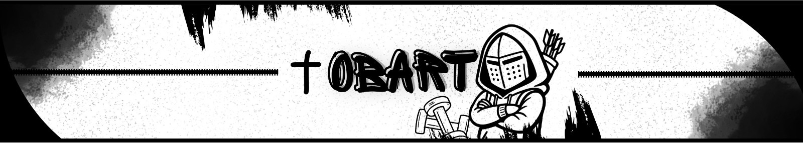

  

<h1 align="center">Bart</h1>

  Software Development • Web • Systems

---

## 🧠 About
I’m focused on software development, building applications, automations and web systems.

Currently studying and improving skills in both front-end and back-end development, with emphasis on structure, performance and practical implementation.

---

## ⚙️ Stack

  

---

## 🧩 Projects
- 💻 Web applications  
- ⚙️ Automation scripts  
- 🌐 Landing pages  
- 🛠️ System experiments  

---

## 📚 Currently Learning
- Backend development  
- System architecture  
- Performance optimization  
- APIs and integrations  

---

## 📫 Contact

  

---

## ⚡ Notes
Focused on building real projects and improving technical skills consistently.
